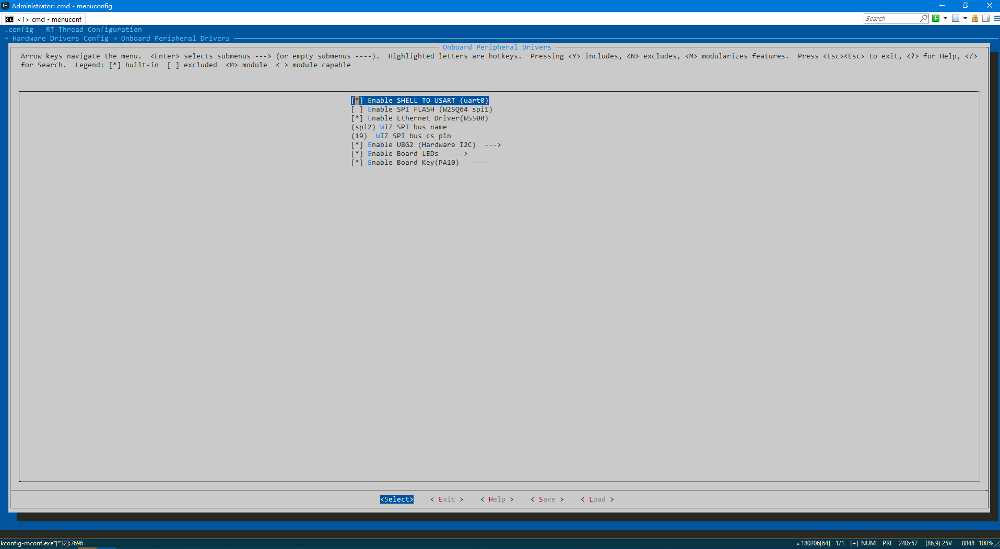
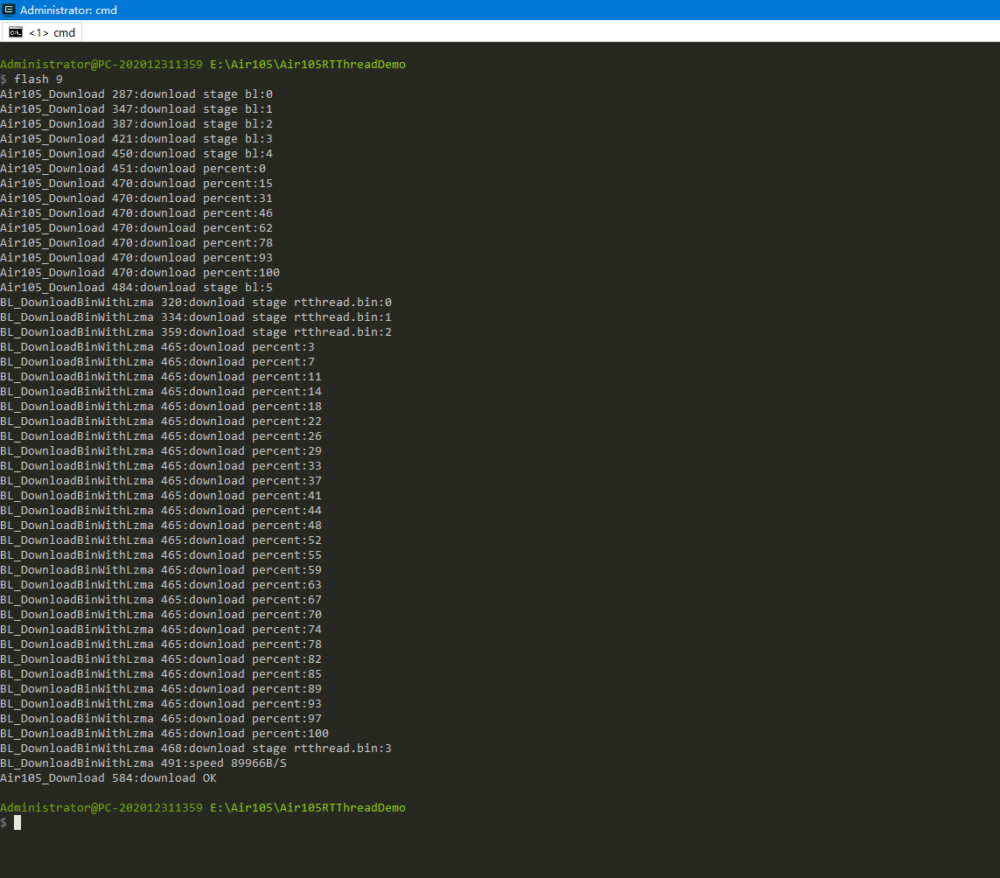

# 说明

这是一个使用[rt-thread](https://www.rt-thread.org/)开发[Air105](http://air105.cn)的例子(仅供测试)。

## 硬件

本工程中使用一些板级外设可在Kconfig中打开或关闭。

硬件板级驱动支持配置在Kconfig的→ Hardware Drivers Config → Onboard Peripheral Drivers中。



### 以太网

Air105本身不支持以太网,但可以使用W5500作为全硬件以太网栈。默认情况下占用SPI2（4个引脚）:

| Air105引脚 | 功能      |
| ---------- | --------- |
| PB4/GPIO20 | SPI2_MOSI |
| PB3/GPIO19 | SPI2_CSN  |
| PB2/GPIO18 | SPI2_CLK  |
| PB5/GPIO21 | SPI2_MISO |

注意:W5500对电源要求极高，需要支持较大的瞬时电流,电源不稳定将导致Air105运行不稳定。

### 显示屏

Air105的内存较大,非常适合用于驱动显示屏,其较大的flash空间也可用于中文字体存储。

本工程采用SSD1306驱动的128x64 OLED显示屏,采用[U8G2](https://github.com/olikraus/u8g2.git)作为显示库。

硬件接口采用硬件I2C(可与其它设备共用I2C总线)。默认情况下占用I2C(两个引脚):

| Air105引脚 | 功能    |
| ---------- | ------- |
| PE6/GPIO70 | I2C_SCL |
| PE7/GPIO71 | I2C_SDA |

注意:由于U8G2采用的是在线软件包,若编译失败请尝试执行bootstrap下载。

### LED

在Air105核心版上,引出了3个LED灯。默认情况下占用3个引脚(此引脚在开发板上未引出):

| Air105引脚 | 功能 |
| ---------- | ---- |
| PD14       | LED0 |
| PD15       | LED1 |
| PC03       | LED2 |


### 内置Flash布局

由于官方手册对flash的描述较少,因此本章纯属个人分析,仅供参考。按照数据手册,内置Flash共4MBytes。

|    名称    |  起始地址  |         长度          | 说明                                                         |
| :--------: | :--------: | :-------------------: | ------------------------------------------------------------ |
| 整个Flash  | 0x01000000 |  0x400000 (4MBytes)   | Flash地址可能是重映射后的地址(以下地址同理)。                |
|   header   | 0x01000000 |   0x1000 (4KBytes)    | Flash 参数信息                                               |
| bootloader | 0x01001000 |   0xF000 (60KBytes)   | bootloader.bin由官方提供,详见[pack](pack) .                  |
|    app     | 0x01010000 | 0x2F0000 (3008KBytes) | app即为应用程序,在本工程为rtthread.bin。注意:app前0x400字节为app信息(由bootloader识别),真正的向量表基址为0x01010400。 |
|   script   | 0x01300000 |  0x80000 (512KBytes)  | 似乎是luatos时的lua脚本所在。本工程暂未使用。                |
|     fs     | 0x01380000 |  0x80000 (512KBytes)  | 似乎是luatos时的可读写flash文件系统所在。本工程暂未使用。    |

综合网上(github.com)关于MH1903(s)的工程,初步推断Flash内部参数同X25QXX系列SPI Flash,部分参数如下:

|   名称   |    值     |           说明            |
| :------: | :-------: | :-----------------------: |
| 扇区大小 | 4096 字节 |  擦除时需要按扇区擦除。   |
|  页大小  | 256 字节  | 写入时需要按页写入Flash。 |


### 按键

按键复用BOOT按键,占用引脚PA10。按键具有以下功能:

- 长按
- 单击
- 双击

## 源代码下载

**注意:由于换行符问题,请在Rt-Thread Env中使用git下载或者下载后在下载目录执行git reset --hard。**

由于本源代码包含第三方源代码,故直接下载可能有部分源代码缺失，需要通过以下方法解决:

- 在进行git clone 使用--recurse-submodules参数。

- 若已通过git clone下载,则在源代码目录中执行以下命令下载子模块:

  ```bash
   git submodule update --init --recursive
  ```

## 脚本说明

### Windows

所有脚本均需要在Rt-Thread Env中执行。

- bootstrap.bat:工程初始化脚本
- flash.bat:烧录脚本

### Ubuntu

- bootstrap :工程初始化脚本

## 资源文件

类似于桌面程序的资源文件。源代码实现的目录为 [rc](rc/)。

在固件编写中，很多时候需要大量的固定数据，直接手工嵌入到C文件里比较麻烦。

通过读取文件转换到对应C文件可大大节省时间，可添加常用的文件（如各种证书）或者不适宜放在可读写的文件系统中的文件(如需要在格式化中保留或者初始参数)。转换程序源代码为[rc/fsgen.cpp](rc/fsgen.cpp)。

使用步骤如下:

- 将待添加的文件放入 rc/fs目录下。

- 使用文件名调用以下函数(需包含相应头文件RC.h):

  ```c++
  //通过名称获取资源大小
  size_t RCGetSize(const char * name);
  
  //通过名称获取资源指针
  const unsigned char * RCGetHandle(const char * name);
  ```

注意:在RT-Thread中,支持使用ROMFS挂载RC资源，代码说明如下:

```c++
//头文件
#include <dfs_fs.h>
#include "dfs_romfs.h"
//挂载所需参数
extern const struct romfs_dirent romfs_root；

    
...
{
    ...
    //挂载romfs。注意:似乎DFSV1只支持挂载到/,挂载到其它地方无效。
    dfs_mount(RT_NULL, "/", "rom", 0, &(romfs_root)
    ...
}
...
```


# 测试截图


# 编译

## Windows

### 工具

- [RT-Thread Env](https://www.rt-thread.org/download.html#download-rt-thread-env-tool):RT-Thread脚本执行环境(包含编译器及配置工具)。注意:需要v1.3.5或更新版本,否则可能失败。
- [CMake](https://cmake.org/):用于生成*.cbp工程。注意:安装时需要添加CMake到PATH。

### 编译步骤

编译操作同bsp下的编译操作,只是需要先使用bootstrap.bat初始化工程。

- 打开Rt-Thread Env工具(运行env.exe,最好使用管理员权限),切换至工程目录(即bootstrap.bat所在目录)。
- 运行bootstrap.bat,将初始化工程并产生build/rtthread.cbp(可采用CodeBlocks打开编辑)。
- 使用scons命令执行编译并打包。

注意:bootstrap.bat通常只需要在需要更新build/rtthread.cbp时使用,最终生成rtthread_air105.soc仍然使用scons命令。

## Ubuntu

### 工具(软件包)

- build-essential
- gcc-arm-none-eabi：arm编译工具链
- python3
- python3-requests
- scons
- wget
- git
- cmake
- ninja-build
- make

可使用以下命令安装:

```bash
sudo apt-get update
sudo apt-get install -yy build-essential gcc-arm-none-eabi python3  python3-requests scons wget git cmake ninja-build make
```


### 编译步骤

编译步骤同Windows,使用bootstrap初始化工程,使用scons编译固件并打包。

注意:如需进入env环境（如执行menuconfig命令）,需要先执行:

```bash
#以下命令仅当bootstrap成功后有效
source ~/.env/env.sh
```


# 烧录

Air105是通过UART0烧录的,烧录格式为.soc,烧录工具为Luatools。

详细工具请查看:https://wiki.luatos.com/pages/tools.html

注意:Luatools下载后默认会占用串口,如需其它工具打开手动关闭Luatools打开的串口。

除了使用Luatools,还可使用flash.bat烧录(需要在RT-Thread Env中运行):

```bat
rem 烧录命令为 flash 串口编号,如使用COM9烧录命令如下.
flash 9
```




# 调试

## 串口

UART0 :1500000 8N1

由于串口的波特率较高,有些工具可能不能正常打开(如putty 0.78)。

# 其它工程

其它工程通常用于参考。

- https://gitee.com/openLuat/luatos-soc-air105.git
- https://gitee.com/iosetting/air105_project.git
- https://gitee.com/luyaoCode/air105_mh1903s.git