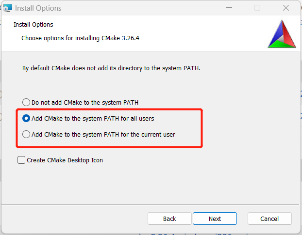

# 说明

这是一个使用[rt-thread](https://www.rt-thread.org/)开发[Air105](http://air105.cn)的例子(仅供测试)。

## 以太网

Air105本身不支持以太网,但可以使用W5500作为全硬件以太网栈。默认情况下占用SPI2（4个引脚）:

| Air105引脚 | 功能      |
| ---------- | --------- |
| PB4/GPIO20 | SPI2_MOSI |
| PB3/GPIO19 | SPI2_CSN  |
| PB2/GPIO18 | SPI2_CLK  |
| PB5/GPIO21 | SPI2_MISO |

注意:W5500对电源要求极高，需要支持较大的瞬时电流,电源不稳定将导致Air105运行不稳定。

## 源代码下载

**注意:由于换行符问题,请在Rt-Thread Env中使用git下载或者下载后在下载目录执行git reset --hard。**

由于本源代码包含第三方源代码,故直接下载可能有部分源代码缺失，需要通过以下方法解决:

- 在进行git clone 使用--recurse-submodules参数。

- 若已通过git clone下载,则在源代码目录中执行以下命令下载子模块:

  ```bash
   git submodule update --init --recursive
  ```

## 脚本说明

### Windows

所有脚本均需要在Rt-Thread Env中执行。

- bootstrap.bat:工程初始化脚本

### Ubuntu

- bootstrap :工程初始化脚本

## 资源文件

类似于桌面程序的资源文件。源代码实现的目录为 [rc](rc/)。

在固件编写中，很多时候需要大量的固定数据，直接手工嵌入到C文件里比较麻烦。

通过读取文件转换到对应C文件可大大节省时间，可添加常用的文件（如各种证书）或者不适宜放在可读写的文件系统中的文件(如需要在格式化中保留或者初始参数)。转换程序源代码为[rc/fsgen.cpp](rc/fsgen.cpp)。

使用步骤如下:

- 将待添加的文件放入 rc/fs目录下。

- 使用文件名调用以下函数(需包含相应头文件RC.h):

  ```c++
  //通过名称获取资源大小
  size_t RCGetSize(const char * name);
  
  //通过名称获取资源指针
  const unsigned char * RCGetHandle(const char * name);
  ```

# 测试截图


# 编译

## Windows

### 工具

- [RT-Thread Env](https://www.rt-thread.org/download.html#download-rt-thread-env-tool):RT-Thread脚本执行环境(包含编译器及配置工具)。注意:需要v1.3.5或更新版本,否则可能失败。
- [CMake](https://cmake.org/):用于生成*.cbp工程。注意:安装时需要添加CMake到PATH。

### 编译步骤

编译操作同bsp下的编译操作,只是需要先使用bootstrap.bat初始化工程。

- 打开Rt-Thread Env工具(运行env.exe,最好使用管理员权限),切换至工程目录(即bootstrap.bat所在目录)。
- 运行bootstrap.bat,将初始化工程并产生build/rtthread.cbp(可采用CodeBlocks打开编辑)。
- 使用scons命令执行编译并打包。

注意:bootstrap.bat通常只需要在需要更新build/rtthread.cbp时使用,最终生成rtthread_air105.soc仍然使用scons命令。

## Ubuntu

### 工具(软件包)

- build-essential
- gcc-arm-none-eabi：arm编译工具链
- python3
- python3-requests
- scons
- wget
- git
- cmake

可使用以下命令安装:

```bash
sudo apt-get update
sudo apt-get install -yy build-essential gcc-arm-none-eabi python3  python3-requests scons wget git cmake
```


### 编译步骤

编译步骤同Windows,使用bootstrap初始化工程,使用scons编译固件并打包。

注意:如需进入env环境（如执行menuconfig命令）,需要先执行:

```bash
#以下命令仅当bootstrap成功后有效
source ~/.env/env.sh
```


# 烧录

Air105是通过UART0烧录的,烧录格式为.soc,烧录工具为Luatools。

详细工具请查看:https://wiki.luatos.com/pages/tools.html

注意:Luatools下载后默认会占用串口,如需其它工具打开手动关闭Luatools打开的串口。


# 调试

## 串口

UART0 :1500000 8N1

由于串口的波特率较高,有些工具可能不能正常打开(如putty 0.78)。